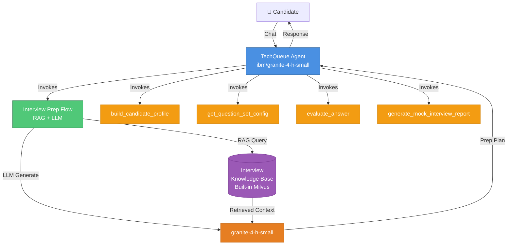
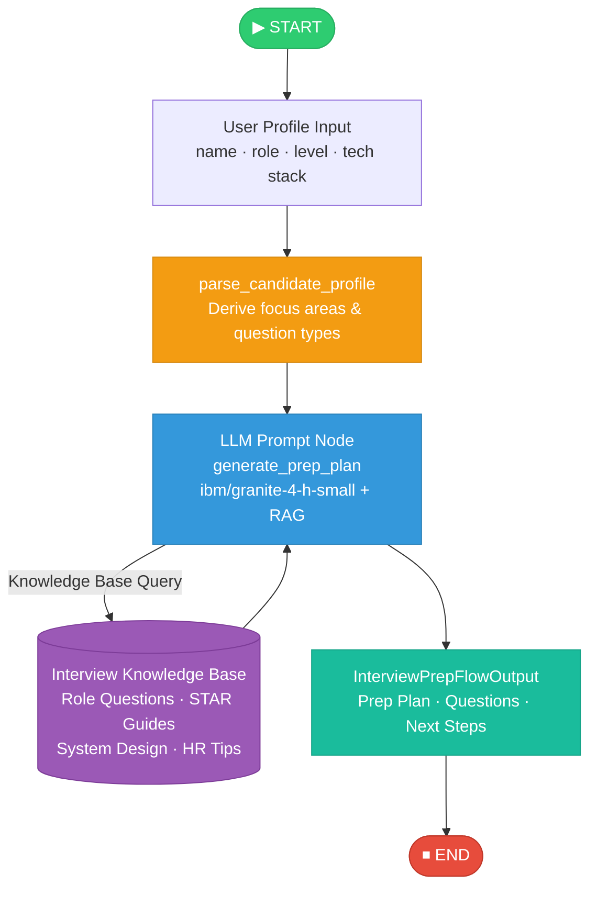
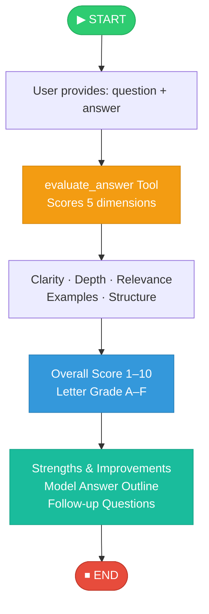

# TechQueue — Your AI-Powered Interview Coach

> An Interview Trainer Agent powered by **RAG (Retrieval-Augmented Generation)** on IBM watsonx Orchestrate.  
> Built with `ibm/granite-4-h-small` and the watsonx Orchestrate ADK.

---
## Problem Statement: 


---
## Overview

**TechQueue** prepares candidates for job interviews by generating tailored question sets and personalised preparation strategies based on their profile, experience level, and target job role.

It retrieves role-specific interview questions, industry expectations, behavioral scenarios, and HR guidelines from a curated knowledge base and uses RAG to deliver context-aware, up-to-date preparation advice.

### Key Features
- 🎯 **Personalised Prep Plans** — Full preparation plans generated from candidate profile via RAG
- 📋 **Tailored Question Sets** — Technical, behavioral, system design, and HR questions per role & level
- 🧠 **Answer Evaluation** — Multi-dimension scoring with strengths, gaps, and model answer outlines
- 📊 **Mock Interview Reports** — Final readiness assessment and action plan after a practice session
- 💬 **Conversational Coach** — Natural chat interface via watsonx Orchestrate

---
## Demo


## Evaluation source


---


## Architecture Diagram



---

## Interview Prep Flow Diagram



---

## Answer Evaluation Flow



---

## Project Structure

```
techqueue_interview_coach/
├── __init__.py
├── main_flow.py                         # Flow test script
├── import-all.sh                        # CLI import script
├── README.md
├── tools/
│   ├── __init__.py
│   ├── profile_tools.py                 # build_candidate_profile, get_question_set_config
│   ├── evaluation_tools.py              # evaluate_answer, generate_mock_interview_report
│   └── interview_prep_flow.py           # Full interview prep flow (RAG + LLM)
├── agents/
│   └── techqueue_interview_coach.yaml   # Agent configuration
├── knowledge_base/
│   └── interview_knowledge_base.yaml    # Knowledge base spec
└── generated/
    └── interview_prep_flow.json         # Compiled flow spec (auto-generated)
```

---

## Tools Reference

| Tool | Type | Purpose |
|------|------|---------|
| `interview_prep_flow` | Flow | Full personalised prep plan via RAG + LLM |
| `build_candidate_profile` | Python | Profile analysis and focus area derivation |
| `get_question_set_config` | Python | Generate categorised question sets |
| `evaluate_answer` | Python | Multi-dimension answer scoring and feedback |
| `generate_mock_interview_report` | Python | Final readiness report card and action plan |

---

## Supported Roles & Levels

| Role Category | Experience Levels | Question Types |
|---------------|-------------------|----------------|
| Software Engineer | Entry / Mid / Senior | Technical · Behavioral · System Design · HR |
| Data Scientist / ML | Entry / Mid / Senior | Technical · Behavioral · Case Study · HR |
| Product Manager | Entry / Mid / Senior | Case Study · Situational · Behavioral · HR |
| DevOps / SRE / Cloud | Entry / Mid / Senior | Technical · System Design · Behavioral · HR |
| General / Other | Entry / Mid / Senior | Behavioral · HR |

---

## Setup & Usage

### Option A: Local Dev Mode (Offline with Ollama & granite3-moe:3b)
The fastest way to test TechQueue locally with zero cloud dependencies:

1. **Start Ollama**:
   ```bash
   ollama serve
   ```
   Ensure `granite3-moe:3b` is available:
   ```bash
   ollama list
   ```

2. **Launch Dev Server**:
   - Double-click `start_dev.bat` or run:
     ```cmd
     start_dev.bat
     ```
   - Open your browser to **`http://localhost:8181`**

---

### Option B: Deploy to watsonx Orchestrate

#### Prerequisites
- watsonx Orchestrate ADK installed
- Active environment configured (`orchestrate env activate`)

#### 1. Import Everything (Windows)
```cmd
import-all.bat
```
*(Or in PowerShell: `.\import-all.ps1`, or in Linux/macOS: `./import-all.sh`)*

#### 2. Start Chatting
```bash
orchestrate chat start
# Select: techqueue_interview_coach
```

#### 3. Test the Flow Programmatically
```cmd
python main_flow.py
```

---

## Sample Interactions

**Starting a session:**
> "I want to prepare for a Senior Backend Engineer interview. My name is Priya, I have 7 years of experience with Go and Kubernetes."

**Getting focused questions:**
> "Give me 5 system design questions for a mid-level Software Engineer."

**Evaluating a practice answer:**
> "Can you evaluate my answer to: 'Explain the CAP theorem'? My answer: [answer text]"

**Getting a readiness report:**
> "I finished 10 practice questions and averaged 7.5/10 for a mid-level SWE role. Give me a readiness report."

---

## Knowledge Base Documents

Upload the following documents to the knowledge base for full RAG coverage:

| Document | Content |
|----------|---------|
| `interview_questions_swe.txt` | Core DSA, concurrency, API design, SOLID, web security |
| `behavioral_interview_guide.txt` | STAR method guide, 4 key competencies, sample answers |
| `hr_interview_guidelines.txt` | HR screening questions, compensation, culture-fit |
| `system_design_prep.txt` | 5-step framework, CAP/PACELC theorems, scaling patterns |
| `data_science_interview_qa.txt` | ML theory, metrics (ROC/PR), A/B testing guardrails |
| `product_manager_interview_prep.txt` | CIRCLES method, RICE/MoSCoW, North Star metrics |

---

## Configuration

| Parameter | Value |
|-----------|-------|
| LLM Model | `ibm/granite-4-h-small` |
| Agent Style | `react_core` |
| Knowledge Base | Built-in Milvus (managed) |
| Embedding Model | `ibm/slate-125m-english-rtrvr-v2` |
| WatsonX URL | `https://us-south.ml.cloud.ibm.com/ml/v1/text/chat?version=2023-05-29` |
| Project ID | `eca423cb-5689-4a9b-9279-0545246fde9c` |
